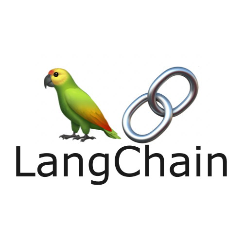

# Fabula-Ex-Machina

 

 

## Overview

- This project is a proof of concept for a generative narrative game, in which a user and a LLM exchange prompts and ideas to write a story together
- Gameplay involves writing prompts to an LLM, and responding to the content is provides. Initially the user provides a title and a prompt for an introduction, to which the LLM provides the content of the introduction. The user then writes a prompt for the first act of the story, to which the LLM provides the content of the first act, and this repeats for three acts.
- There are several limitations put in place for this proof of concept, includes a maximum of 200 characters for a response, prompt engineering to ensure that the LLM only produces a response of 300 maximum words, and only three acts of story writing. This is to reduce the amount of tokens used in the API calls when playing the game, as the game itself is only a proof of concept
- The background creative coding sketch was adapted from [this sketch](https://openprocessing.org/sketch/1597047) by [Samuel Yan](https://openprocessing.org/user/293890?view=sketches&o=48)
- The model that the LLM uses is [gpt 3.5. turbo](https://platform.openai.com/docs/models/gpt-3-5)

## DISCLAIMER: Client-Side Submission of API Key

- This proof of concept involves submitting an OpenAI API key through the client-side of the application. This is for testing purposes, as a test API key was used for this proof of concept, and a client-side submission always continued use of the proof of concept beyond the expiry of this test key
- This is _not_ a recommended implementation for a production-level application involving OpenAI API keys, as this represents potential security risks
- Do not submit legitimate OpenAI API keys through the client-side for applications that you do not trust or know the source code for

## Prompt Engineering

- This proof of concept is a use case for [prompt engineering](https://www.promptingguide.ai/)
- Two key prompts were used when generating responses, specifically:

### System Prompt

- A system prompt was used to 'prime' the LLM for the outputs it was to produce. This system prompt involved 'setting the scene' for the LLM, informing it that it is to produce creative pieces in response to user input, and that it would be required to produce an introduction followed by three acts

### User Input Prompt

- The user's input was transposed into a template that was delivered to the LLM, including affixing which stage of the story that this input was in relation to, in order to properly contextualise the LLM's output
